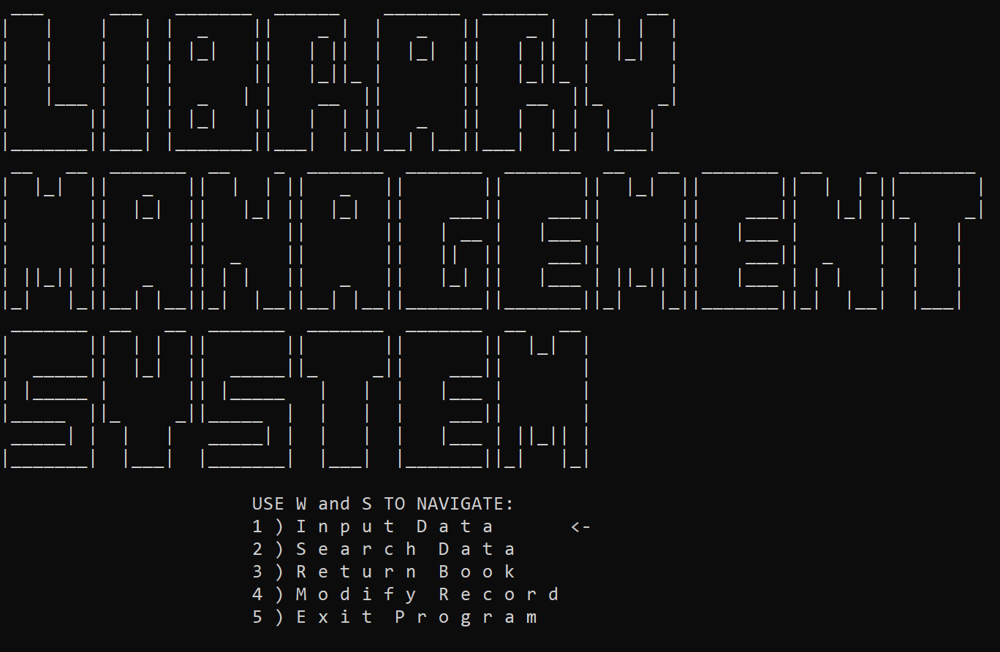

# Library Management System

This program helps is console based implementation of a library management system in C++. It provides a framework to issue, return, and search book records.

The user starts on a menu interface that uses the W and S keys to navigate up and down, respectively, and the enter key to select. They can choose to Input Data, Search Data, Return Book, Modify Records, or Exit the program.

- If Input Data is selected, the program gives the option to choose the number of records to be entered, followed by asking each user to enter their Serial number, Name, Book name, and Date of issue (date, month, and year).
- If Search Data is selected, the program allows users to search records based on serial number. The program then displays the Name, Book name, and issue date.
- If Return Book is selected, the program allows users to return a book according to the entered serial number. The user then enters the return date, and a late fee is calculated.
- If Modify Records is selected, the user enters an administrator password. If it is correct, the user can search for a serial number. If the serial number exists, the user can enter a new name, book name, and issue date.

